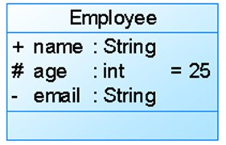
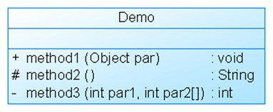

## uml类图实例
* **属性**

* **方法**

  

  

* **内部类**

## 设计原则

| 设计原则名称                                           | 设计原则简介                                                 | 重要性 |
| ------------------------------------------------------ | ------------------------------------------------------------ | ------ |
| **单一职责原则**(Single Responsibility Principle, SRP) | 类的职责要单一，不能将太多的职责放在一个类中                 | ★★★★☆  |
| **开闭原则**(Open-Closed Principle, OCP)               | 软件实体对扩展是开放的，但对修改是关闭的，即在不修改一个软件实体的基础上去扩展其功能 | ★★★★★  |
| **里氏代换原则**(Liskov Substitution Principle, LSP)   | 在软件系统中，一个可以接受基类对象的地方必然可以接受一个子类对象 | ★★★★☆  |
| **依赖倒转原则**(Dependency Inversion Principle, DIP)  | 要针对抽象层编程，而不要针对具体类编程                       | ★★★★★  |
| **接口隔离原则**(Interface Segregation Principle, ISP) | 使用多个专门的接口来取代一个统一的接口                       | ★★☆☆☆  |
| **合成复用原则**(Composite Reuse Principle, CRP)       | 在系统中应该尽量多使用组合和聚合关联关系，尽量少使用甚至不使用继承关系 | ★★★★☆  |
| **迪米特法则**(Law of Demeter, LoD)                    | 一个软件实体对其他实体的引用越少越好，或者说如果两个类不必彼此直接通信，那么这两个类就不应当发生直接的相互作用，而是通过引入一个第三者发生间接交互 | ★★★☆☆  |

